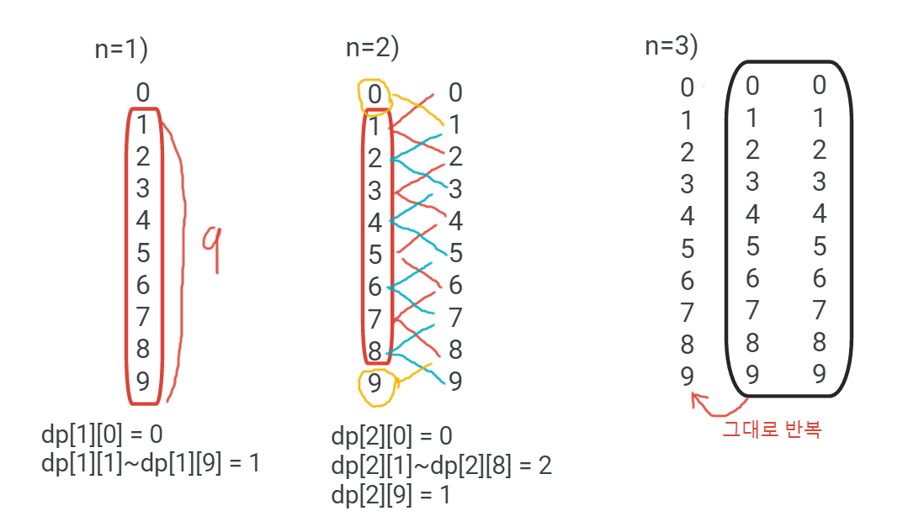

## 10844 쉬운 계단수

### 문제
45656이란 수를 보자.
이 수는 인접한 모든 자리의 차이가 1이다. 이런 수를 계단 수라고 한다.
N이 주어질 때, 길이가 N인 계단 수가 총 몇 개 있는지 구해보자. 0으로 시작하는 수는 계단수가 아니다.

### 입력
첫째 줄에 N이 주어진다. N은 1보다 크거나 같고, 100보다 작거나 같은 자연수이다.

### 출력
첫째 줄에 정답을 1,000,000,000으로 나눈 나머지를 출력한다.

#### 접근 방법
100은 계단 수가 되는 경우의 수가 101, 121, 123 이 있으나 n은 100보다 작거나 같은 수이다.
100은 제외 가능하다

dp[i][j] : i자리 수인 계단 수 중에 맨 끝이 j인 수의 개수
1자리 계단 수는 1~9가 존재. 따라서 1자리 계단 수 중 1~9로 끝나는 수의 개수는 각 1개

현재 자리 수의 계단 수는 이전 자리 계단 수 끝에 (이전 자리 계단 수의 끝 자리 수 -1, +1) 해준 수를 붙이는 경우이다.
ex. 2자리 계단 수를 구한다고 할 때
1의 자리 계단 수 = 1, 2, 3, 4, 5, 6, 7, 8, 9
1의 끝에 (1-1 = 0) 과 (1+1 = 2)를 붙인 수 -> 10, 12
2의 끝에 (2-1 = 1) 과 (2+1 = 3)를 붙인 수 -> 21, 23
3의 끝에 (3-1 = 2) 과 (3+1 = 4)를 붙인 수 -> 32, 34
4의 끝에 (4-1 = 3) 과 (4+1 = 5)를 붙인 수 -> 43, 45
5의 끝에 (5-1 = 4) 과 (5+1 = 6)를 붙인 수 -> 54, 56
6의 끝에 (6-1 = 5) 과 (6+1 = 7)를 붙인 수 -> 65, 67
7의 끝에 (7-1 = 6) 과 (7+1 = 8)를 붙인 수 -> 76, 78
8의 끝에 (8-1 = 7) 과 (8+1 = 9)를 붙인 수 -> 87, 89
9의 끝에 (9-1 = 8)를 붙인 수 -> 98

위 과정을 일반화하여 dp를 갱신하면
맨 끝이 0인 자리 수의 개수 = 이전 자리 수 중 1로 끝나는 수의 개수
맨 끝이 9인 자리 수의 개수 = 이전 자리 수 중 8로 끝나는 수의 개수
맨 끝이 j(1~8)인 자리 수의 개수 = 이전 자리 수 중 j - 1, j + 1로 끝나는 수의 개수의 합

이를 점화식으로 표현하면
dp[i][0] = dp[i - 1][1]
dp[i][9] = dp[i - 1][8]
(j : 1 ~ 8) dp[i][j] = dp[i - 1][j - 1] + dp[i - 1][j + 1]

dp[n]에 0 ~ 9로 끝나는 i자리 계단 수들의 개수가 각각 저장되어있으므로 해당 수들을 전부 더하면 n자리 계단 수들의 총 개수를 알 수 있다.

=======================================================
2) DP[a][b] = 길이가 a 일 때 마지막 수가 b일 경우의 계단의 수를 의미한다.
3) DP[1][x] 의 경우 x에 어떤 값이 오더라도 1이 될것이다.   
    왜냐하면, 한 자리 숫자는 1~9 모두 계단 수 이기 때문이다. 
    그리고 이식을 초기식으로 사용한다.
4) 2)같은 식을 생각해본 이유는 2자리 숫자를 만들 때, 중요한 것은 첫 째자리(마지막 수) 수이기 떄문이다.   
    예를 들어, 2자리 숫자 중 앞에 자리를 1로 선택했다고 해보자.   
    그렇다면 나올 수 있는 두자리 수는 10, 12 이다. 5로 선택했다고 가정하면 54, 56이 될것이다.   
    3자리를 만드는데 앞에 2자리 중 마지막 자리 숫자에 따라서 가장 마지막 자리에 올 수 있는 숫자가 결정될 수 있는 것이다. 
    예를들어 10, 34, 56, 89 라는 숫자인 상태에서 숫자 하나를 추가해서 3자리를 만든다고 생각해보자.   
    10의 경우 2자리 중 마지막 자리 숫자인 0에 의해서 뒤에 올 수 있는 숫자는 1 하나 뿐이고  
    34의 경우 2자리 중 마지막 자리 숫자인 4에 의해서 뒤에 올 수 있는 숫자는 3과 5 두개가 된다.
    56의 경우 5와 7이 있고, 9의 경우 8이 올 수 있다.
    즉, 만들어 놓은 수의 마지막 숫자에 의해서 그 다음에 올 수 있는 숫자들의 경우의 수가 정해지게 된다,
    하지만, 모든 경우의 수가 같은 것은 아니다. 
    위에서 말했다 시피 마지막 자리가 0과 9인 경우에는 경우의 수가 한개이고
    나머지 숫자들에 대해서는 2개의 경우가 성립하게 된다.
5) 3)에서 말한 초기식을 기반으로 점화식을 생각해보면
    2자리를 만드는 경우, 끝자리가 0으로 오는 경우의 수는(DP[2][0]) 10 한개 이다.
    2자리를 만드는 경우, 끝자리가 4로 오는 경우의 수는(DP[2][4]) 34, 54 2개 이다.
    2자리를 만드는 경우, 끝자리가 6으로 오는 경우의 수는(DP[2][6]) 56,76 2개이다.
    3자리를 만드는 경우, 끝자리가 5로 오는 경우의 수는(DP[3][5]) DP[2][4] + DP[2][6]가 된다.
    즉 점화식은 DP[i][j] = DP[i-1][j-1] + DP[i-1][j+1]이 된다.
    하지만, 마지막 자리가 0과 9인 경우에 대해서는 2가지가 아닌 한 가지 경우이므로 이 부분만 따로 조건을 걸어줘야 한다.

