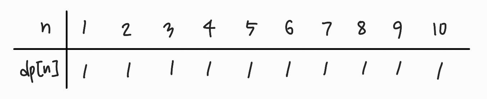
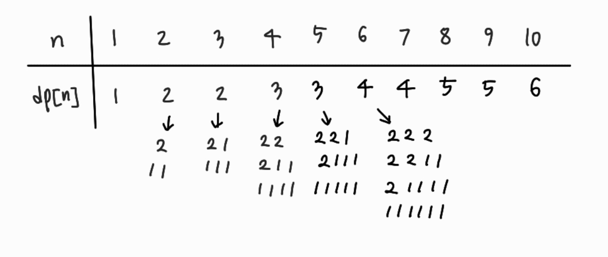
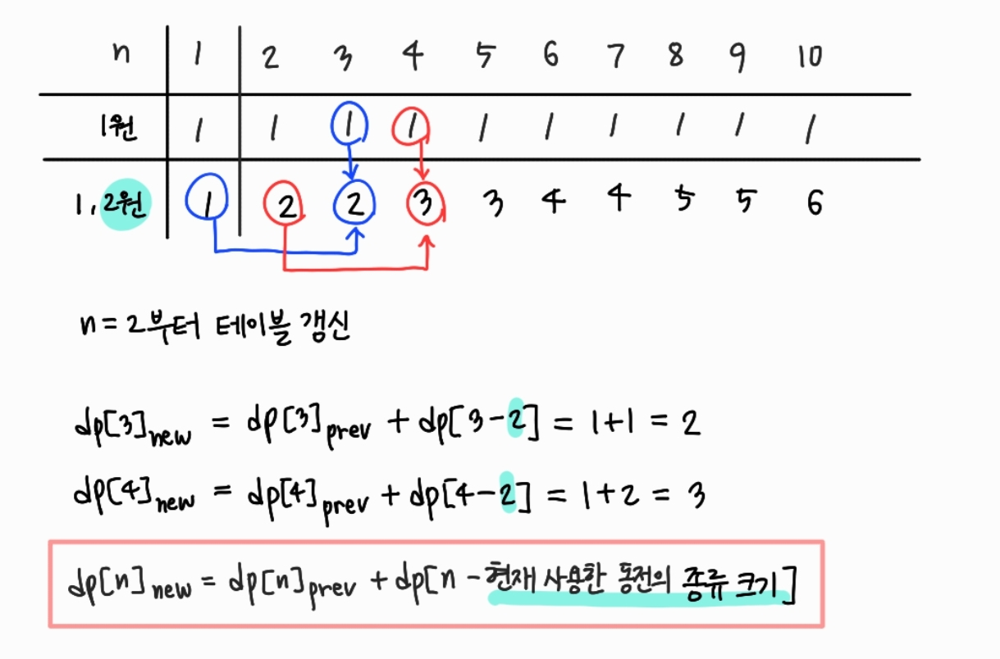
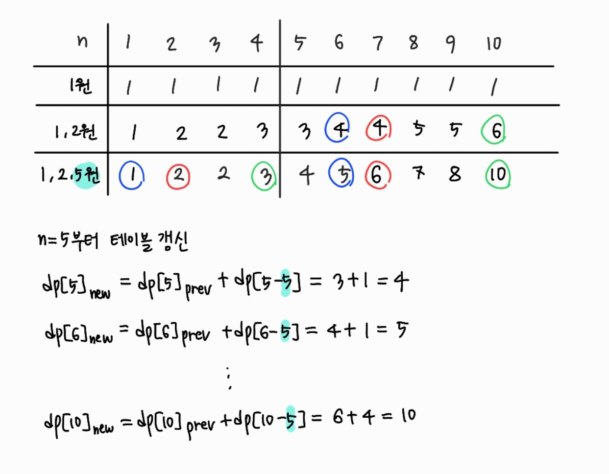

## 2293 동전 1

DP

https://www.acmicpc.net/problem/2293

### 문제
n가지 종류의 동전이 있다. 각각의 동전이 나타내는 가치는 다르다. 이 동전을 적당히 사용해서, 그 가치의 합이 k원이 되도록 하고 싶다. 그 경우의 수를 구하시오. 각각의 동전은 몇 개라도 사용할 수 있다.

사용한 동전의 구성이 같은데, 순서만 다른 것은 같은 경우이다.

### 입력
첫째 줄에 n, k가 주어진다. (1 ≤ n ≤ 100, 1 ≤ k ≤ 10,000) 다음 n개의 줄에는 각각의 동전의 가치가 주어진다. 동전의 가치는 100,000보다 작거나 같은 자연수이다.

### 출력
첫째 줄에 경우의 수를 출력한다. 경우의 수는 231보다 작다.

#### 접근방법

우선, 1원으로 n원을 만드는 경우의 수는 다음과 같다.

다음으로, 1원과 2원을 조합하여 n원을 만드는 경우의 수는 다음과 같다.

그러면 다음과 같은 규칙성을 발견할 수 있다.

즉, 새로 갱신되는 dp[n]의 값은 이전의 dp[n]의 값에 dp[n - 현재 사용한 동전의 종류 크기] 가 되는 것이다.

결국, 1, 2, 5원으로 10원을 만드는 경우의 수는 10개라는 것을 알 수 있다. 아 그리고 주의해야 할 것은, dp[0]은 주어진 동전을 갖고 0원을 만드는 경우의 수인데, 이것은 결국 어떤 동전도 사용하지 말아야 하므로 경우의 수는 1이다. 따라서 dp[0]은 1이다.

v가 n개의 동전 종류를 저장하는 배열이라고 했을 때, 위에서 발견한 규칙성에 따라 다음과 같이 점화식을 작성할 수 있다.

dp[n] = dp[n] + dp[n - v[i]]

------------------------------------------

{ 1 , 2 , 3 } 원 짜리 동전이 있고 이를 이용해서 1원, 2원, 3원을 만드는 경우를 알아보자.

- '1'원짜리만 사용해서 만들 수 있는 경우
    - '1'원을 만드는 경우의 수 = 1가지
    - '2'원을 만드는 경우의 수 = 1가지
    - '3'원을 만드는 경우의 수 = 1가지 

- '2'원짜리만 사용해서 만들 수 있는 경우
    - '1'원을 만드는 경우의 수 = 0가지 (그 가치가 이미 2원이기 때문에 어떻게 조합을 하더라도 1원을 만들 수는 없다. )
    - '2'원을 만드는 경우의 수 = 1가지 (2원짜리를 1개 사용해서 2원 만들기)
    - '3'원을 만드는 경우의 수 = 0가지

- '3'원짜리만 사용해서 만들 수 있는 경우
    - '1'원을 만드는 경우의 수 = 0가지
    - '2'원을 만드는 경우의 수 = 0가지
    - '3'원을 만드는 경우의 수 = 1가지

- 1,2,3원 짜리를 사용해서 만들 수 있는 경우
    - '1'원을 만드는 경우의 수 = 1가지
    - '2'원을 만드는 경우의 수 = 2가지
        - 1원짜리로만 2원만드는 방법 한가지,  
        - 2원짜리로 2원만드는 방법 한가지
    - '3'원을 만드는 경우의 수 = 3가지
        - 1원짜리로만 3원 만드는 방법 한가지
        - (1원짜리 + 2원짜리)로 3원 만드는 방법 한가지
        - 3원짜리로 3원 만드는 방법 한가지

DP[a] = b 의 의미는 "a원을 만들 수 있는 경우의 수는 b가지 입니다." 라는 것을 의미한다.
현재 X원인 동전을 가지고 있다면, 이 동전을 이용해서 Y원을 만들고 싶다면, DP[Y] = DP[Y] + DP[Y - X]가 된다.

- 0원에서 3원짜리 하나를 사용해서 3원을 만드는 상황
    - DP[3] += DP[0]이 된다. 
    - 왜 ?? 0원을 만들 수 있는 경우의 수에서 3원 하나를 사용하는 경우이기 때문이다.

- '1원'에서 2원짜리 하나를 사용해서 '3'원을 만드는 상황 
    - DP[3] += DP[1] 이 된다. 
    - 왜 ?? 이 상황은 2원을 사용해서 3원을 맞추려고 한다. 
    - 그럼 ? 기존에 이미 1원을 가지고 있어야 하기 때문이다.

- '2'원에서 1원짜리를 사용해서 '3'원을 만드는 상황
    - DP[3] += DP[2]가 된다. 
    - 왜 ? 현재 '1'원을 이용해서 3원을 맞추려면, 기존에 2원이 있어야 하고, 이 2원을 만드는 방법은 DP[2]에 저장되어 있기 때문이다.

=======================================================
1로 1을 만드는 방법 : 1			dp[1] = +1 (dp[0])
1로 2를 만드는 방법 : 1	+ 1		dp[2] = +1로 1을 만드는 방법(dp[1]) : dp[2-1]
1로 3을 만드는 방법 : 1 + 2		dp[3] = +1로 2를 만드는 방법(dp[2]) : dp[3-1]
1로 4를 만드는 방법 : 1	+ 3		dp[4] = +1로 3을 만드는 방법(dp[3]) : dp[4-1]
1로 5를 만드는 방법 : 1	+ 4		dp[5] = +1로 4을 만드는 방법(dp[4]) : dp[5-1]
1로 6을 만드는 방법 : 1	+ 5		dp[6] = +1로 5을 만드는 방법(dp[5]) : dp[6-1]
1로 7을 만드는 방법 : 1	+ 6		dp[7] = +1로 6을 만드는 방법(dp[6]) : dp[7-1]
1로 8을 만드는 방법 : 1	+ 7		dp[8] = +1로 7을 만드는 방법(dp[7]) : dp[8-1]
1로 9를 만드는 방법 : 1	+ 8		dp[9] = +1로 8을 만드는 방법(dp[8]) : dp[9-1]
1로 10을 만드는 방법 : 1 + 9		dp[10] = +1로 9을 만드는 방법(dp[9]) : dp[10-1]

2로 1을 만드는 방법 : 0
2로 2를 만드는 방법 : 2			dp[2] = +1 (dp[0])
2로 3를 만드는 방법 : 2 + 1		dp[3] = +2로 1을 만드는 방법(dp[1]) : +1
2로 4를 만드는 방법 : 2 + 2		dp[4] = +2로 2를 만드는 방법(dp[2]) 
2로 5를 만드는 방법 : 2 + 3		dp[5] = +2로 3을 만드는 방법(dp[3])
2로 6를 만드는 방법 : 2 + 4		dp[6] = 2로 4을 만드는 방법(dp[4]) 
2로 7를 만드는 방법 : 2 + 5		dp[7] = 2로 5을 만드는 방법(dp[5]) 
2로 8를 만드는 방법 : 2 + 6		dp[8] = 2로 6을 만드는 방법(dp[6]) 
2로 9를 만드는 방법 : 2 + 7		dp[9] = 2로 7을 만드는 방법(dp[7]) 
2로 10를 만드는 방법 : 2 +8		dp[10] = 2로 8을 만드는 방법(dp[8]) 

5로 1을 만드는 방법 : 0
5로 2를 만드는 방법 : 0
5로 3를 만드는 방법 : 0
5로 4를 만드는 방법 : 0
5로 5를 만드는 방법 : 1			dp[5] = +1 (dp[0])
5로 6를 만드는 방법 : 5 + 1		dp[6] =5로 1을 만드는 방법(dp[1])
5로 7를 만드는 방법 : 5 + 2		dp[7] = 5로 2을 만드는 방법(dp[2]) 
5로 8를 만드는 방법 : 5 + 3		dp[8] = 5로 3을 만드는 방법(dp[3]) 
5로 9를 만드는 방법 : 5 + 4		dp[9] = 5로 4을 만드는 방법(dp[4]) 
5로 10를 만드는 방법 : 5 +5		dp[10] = 5로 5을 만드는 방법(dp[5]) 

dp[0] = 1
dp[1] = 1
dp[2] = 1		2
dp[3] = 1		2
dp[4] = 1		3(1+2) dp[4]+dp[2]
dp[5] = 1		3(1+2) dp[5]+dp[3]
dp[6] = 1		4(1+3) dp[6]+dp[4]
dp[7] = 1		4(1+3) dp[7]+dp[5]
dp[8] = 1		5(1+4) dp[8]+dp[6]
dp[9] = 1		5(1+4) dp[9]+dp[7]
dp[10] = 1		6(1+5) dp[10]+dp[8]

dp[0] = 1
dp[1] = 1
dp[2] = 2	// 11, 2
dp[3] = 2	// 111, 12
dp[4] = 3	// 1111, 112, 22
dp[5] = 3	// 11111, 1112, 122
dp[6] = 4	// 111111, 11112, 1122, 222
dp[7] = 4
dp[8] = 5
dp[9] = 5
dp[10] = 6

dp[0] = 1
dp[1] = 1
dp[2] = 2
dp[3] = 2
dp[4] = 3
dp[5] = 4
dp[6] = 5
dp[7] = 6
dp[8] = 7
dp[9] = 8
dp[10] = 10